# 英国海关编码税率查询工具 (cursor-tax-tools)

## 🎯 项目愿景

为英国海关从业者、外贸公司和物流企业提供一个高效、准确的关税编码查询和税率计算工具，支持批量处理、自动更新和离线使用，致力于成为英国关税领域最专业的桌面解决方案。

## 🏗️ 架构总览

### 系统架构图

```mermaid
graph TD
    A["(根) cursor-tax-tools"] --> B["用户界面层"];
    A --> C["业务逻辑层"];
    A --> D["数据处理层"];
    A --> E["外部服务层"];

    B --> B1["launch_gui.py - 启动器"];
    B --> B2["tariff_gui.py - 主GUI"];
    B --> B3["batch_gui.py - 批量处理GUI"];
    B --> B4["enhanced_gui.py - 增强GUI"];

    C --> C1["tariff_api.py - 关税API"];
    C --> C2["batch_processor.py - 批量处理器"];
    C --> C3["scraper.py - 数据爬虫"];

    D --> D1["tariff_db.py - 数据库操作"];
    D --> D2["tariff_db_optimized.py - 优化数据库"];
    D --> D3["datas/tariffs.db - SQLite数据库"];

    E --> E1["UK Trade Tariff API"];
    E --> E2["GitHub智能更新"];
    E --> E3["远程数据同步"];

    F["自动化脚本"] --> F1["scripts/actions"];
    F --> F2["scripts/clients"];
    F --> F3["scripts/monitoring"];

    A --> F;

    click B2 "./tariff_gui.py" "查看主GUI代码"
    click C1 "./tariff_api.py" "查看关税API代码"
    click D1 "./tariff_db.py" "查看数据库操作代码"
    click F1 "./scripts/actions" "查看自动化脚本"
```



### 技术栈
- **前端**: Python Tkinter (桌面应用)
- **数据存储**: SQLite + pandas + openpyxl
- **网络爬虫**: aiohttp + BeautifulSoup4
- **模糊匹配**: python-Levenshtein + jellyfish
- **自动化**: GitHub Actions + Python Scripts
- **性能监控**: psutil + 自定义监控工具

## 📋 模块索引

| 模块 | 路径 | 主要职责 | 技术特点 |
|------|------|----------|----------|
| **启动器** | `launch_gui.py` | 应用程序入口，提供多版本GUI选择 | 模块化启动，依赖检查 |
| **主界面** | `tariff_gui.py` | 核心GUI，支持单个/批量查询和更新 | 多标签页，异步操作，右键菜单 |
| **批量GUI** | `batch_gui.py` | Excel批量处理专用界面 | 文件处理，进度跟踪，历史记录 |
| **增强GUI** | `enhanced_gui.py` | 集成远程数据更新的增强版本 | 智能更新，状态监控 |
| **关税API** | `tariff_api.py` | 关税数据查询和匹配核心逻辑 | 模糊匹配算法，相似度计算 |
| **批量处理** | `batch_processor.py` | Excel文件批量处理引擎 | 并发处理，错误处理 |
| **数据爬虫** | `scraper.py` | 英国政府网站数据爬取 | 异步爬虫，重试机制 |
| **数据库** | `tariff_db.py` | SQLite数据库操作封装 | 事务管理，数据完整性 |
| **智能更新** | `smart_update_client.py` | 远程数据自动更新客户端 | 增量更新，哈希验证 |
| **自动化脚本** | `scripts/` | GitHub Actions和运维脚本 | CI/CD，监控，清理 |

## 🚀 运行与开发

### 环境要求
- Python 3.10+
- Windows 7+ (主要平台)
- 依赖包见 `requirements.txt`

### 快速启动
```bash
# 安装依赖
pip install -r requirements.txt

# 启动应用（推荐方式）
python launch_gui.py

# 直接启动主界面
python tariff_gui.py

# 仅启动批量处理界面
python batch_gui.py
```

### 开发模式
```bash
# 运行测试
python -m pytest tests/

# 性能监控
python scripts/monitoring/performance_monitor.py --duration 60

# 调试爬虫
python scraper.py --debug
```

## 🧪 测试策略

### 测试分类
1. **单元测试** (`tests/`)
   - `test_search_engine.py`: 搜索算法测试
   - `test_web_scraper.py`: 爬虫功能测试
   - `test_llm_api.py`: API集成测试

2. **集成测试** (根目录临时测试文件)
   - 数据库连接测试
   - GUI组件测试
   - 端到端流程测试

3. **性能测试**
   - 批量处理性能
   - 内存使用优化
   - 并发请求测试

### 测试数据
- 使用模拟数据进行测试
- 数据库隔离测试环境
- 自动化测试清理

## 📝 编码规范

### Python代码风格
- 遵循PEP 8规范
- 使用中文注释和文档字符串
- 类名使用PascalCase，函数使用snake_case

### 项目特定规范
1. **文件命名**
   - GUI相关文件以 `_gui.py` 结尾
   - 测试文件以 `test_` 开头
   - 配置文件使用 `.json` 或 `.yml`

2. **错误处理**
   - 统一使用 logging 模块
   - 异常信息需包含足够上下文
   - 用户友好的错误提示

3. **数据库操作**
   - 使用事务确保数据一致性
   - 定期数据备份
   - 性能索引优化

## 🤖 AI使用指引

### AI助手开发建议
1. **优先级任务**
   - 优化模糊匹配算法
   - 增强数据爬虫稳定性
   - 改进用户体验

2. **关键模块理解**
   - `tariff_api.py`: 核心业务逻辑
   - `tariff_gui.py`: 主要用户界面
   - `scraper.py`: 数据获取源头

3. **数据敏感操作**
   - 数据库操作需谨慎
   - 爬虫频率控制
   - 用户数据隐私保护

4. **性能优化重点**
   - 大文件批量处理
   - 内存使用优化
   - 网络请求效率

## 📅 变更记录 (Changelog)

### 2025-11-23 17:38:51
- ✨ 初始化AI上下文文档
- 🏗️ 生成模块结构图和架构总览
- 📋 完成模块索引和开发指南
- 🔧 添加编码规范和AI使用指引

### 近期更新
- 添加智能远程更新功能
- 优化批量处理性能
- 增强数据爬虫稳定性
- 完善用户界面体验

---

**作者**: 猫娘 幽浮喵 (浮浮酱)
**技术栈**: Python + Tkinter + SQLite + 网络爬虫
**目标**: 打造英国关税领域最专业的桌面查询工具 🏷️✨